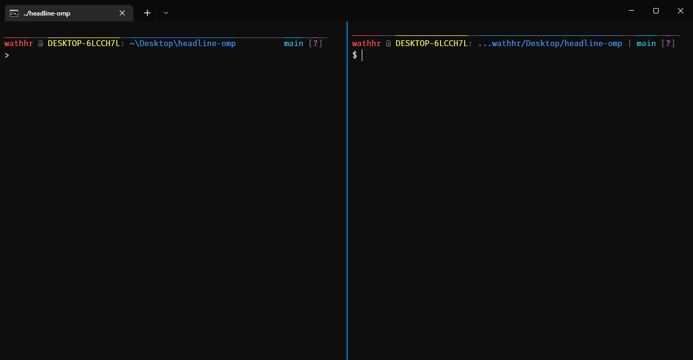

# Headline OMP
A port of the [ZSH Headline theme](https://github.com/Moarram/headline/) for [Oh My Posh](https://ohmyposh.dev/).

## Installation
Take a look at the official [Oh My Posh Docs](https://ohmyposh.dev/docs/)!

## Variations
Information about the different variations.

| Variation  | Description                                                       |
| ---------- | ----------------------------------------------------------------- |
| Base       | The base theme, resembles the original theme as much as possible. |
| Base Icons | Same as the base theme, also including the original icons.        |
| Plus       | The base theme with random additions I thought were nice.         | <!-- TODO: add feature list to this -->
| Plus Icons | Same as the plus theme, also including the original icons.        |

## Bugs
1. On Windows, the headline doesn't render anywhere but in Windows Terminal, unsure why this really happens.
2. When the prompt is bigger than the terminal itself, the prompt wraps to the next line, rather than creating a separator and cutting off the path, like on the original theme.
3. The prompt doesn't cover the entire line, leaving a gap at the end.

## Credits
- [Moarram](https://github.com/Moarram/) for the original idea.
- [Jan De Dobbeleer](https://github.com/JanDeDobbeleer) for adding the overline text decoration and actually making this possible.
